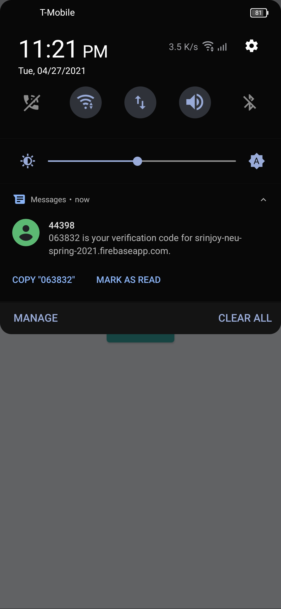

# Neighbours_Yard

A new Flutter project.

## Pre-requisties

1. Intall Java.
2. Install Android Studio
3. Install Flutter.

## Getting Started
This project is a starting point for a Flutter application. (Clone and open this repo in your IDE i.e, Android Studio)

```bash
$ flutter clean
$ flutter upgrade
$ flutter pub get
$ flutter run
```

## SCREENSHOTS

<br/>

   

   > App on login page.
<br/>
<br/>

   

   > User can sign in using google, using Firebase Auth functionality.
<br/>
<br/>


   > User can sign in using phone number, using Firebase Auth functionality.
<br/>
<br/>


   > User verifying its not a robot, , using Google recaptcha API functionality.
<br/>
<br/>



   > User receives an OTP to sign in, using Firebase Auth functionality.
<br/>
<br/>


   > User enters OTP to sign in.
<br/>
<br/>


   > Validaitons in place to enforce security.
<br/>
<br/>


   > Toast used to alert user its already registered.
<br/>
<br/>


   > User resetting password for the email that will receive an link to reset password using SMTP and Firebase Auth.
<br/>
<br/>


   > User enters new password to attach to email account.
<br/>
<br/>


   > User logged in, viewing list item screen.
<br/>
<br/>


   > User asked for permission (Location,Camera, and Gallery) for uploading pictures and determing location.
<br/>
<br/>


   > User given the option to choose betwen camera and gallery to upload pictures.
<br/>
<br/>


   > User alerted to wait while pictures are uploaded to Firestore.
<br/>
<br/>


   > Firebase Vision used for image classification and prediction of the image selected.
<br/>
<br/>


   > Item successfully listed with the location deteremined automatically.
<br/>
<br/>


## DEMO
[](https://www.youtube.com/watch?v=rmLs9AjbmI0)

## APK
[]()

## AUTHORS
[](https://github.com/srinjoychakravarty)
[](https://github.com/HardikThakkar94)
